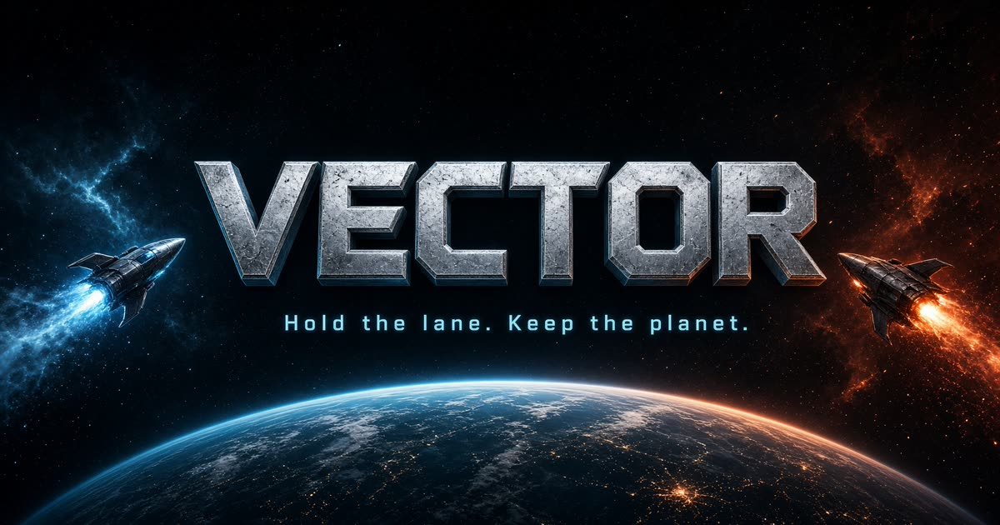

# VECTOR

Draft once. Plant guns on moons. Hold 12.



Browser tower defense. You draft a small hand before the fight. The waves do not stop for more cards.

## A run

1. Pick a bound craft. It is already flying.
2. Draft. First pick is two guns that work together. Then fill the empty moons. Last two picks are Signals.
3. Plant on lit moons. Hit Defend.
4. Hold 12. That is a win.
5. Keep flying for score, or return and draft again.

Kills pay Credit. Spend it on a planted gun during the run, or in the Vault between runs. First Vault buys take a few wins.

A Signal is a rule for this run. Not a gun. You pick two. They stay on.

On a phone the draft is one card. Swipe for the next. Tap the card to flip it. Take is its own button.

## Run it

```
npm install
npm run dev
```

Dev server is port 8080.

```
npm run typecheck
npm run build
```

Version lives in `src/game/version.ts` and shows on the title. Current: **0.9.1**.

Saves stay in the browser. You do not need an account to play.

## Where things are

| | |
|---|---|
| Rules and sim | `src/game/` |
| Screens | `src/components/game/` |
| Card and enemy art | `public/game/` |
| Design notes | `PLAN.md` |
